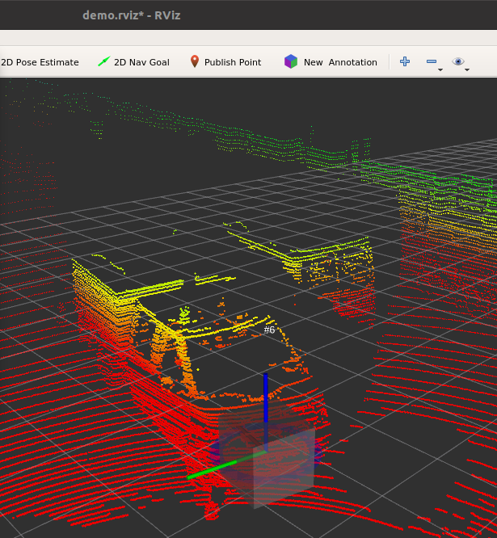

# Labeling with annotate

## Quick start
Let's start with a quick introduction for the impatient. It will cover the basic annotation steps. The rest of the document will cover these steps in more details, including tips and tricks for efficient annotation.

We will use a real-world labeling example taken from the [KITTI Vision Benchmark Suite](http://www.cvlibs.net/datasets/kitti/). The bag file we use is a 16 seconds long traffic sequence called 2011_09_26_drive_0005.bag created using [kitti_to_rosbag](https://github.com/ethz-asl/kitti_to_rosbag). It provides lidar data from a Velodyne HDL-64 in the velodyne_points topic. Our goal is to label the cars, bicycles and pedestrians in it. We can tell the ```demo.launch``` launch file about this setting:

```bash
roslaunch annotate demo.launch \
  bag:="/workspace/kitti/2011_09_26/2011_09_26_drive_0005_sync_pointcloud.bag --pause-topics velodyne_points" \
  pointcloud_topic:=/velodyne_points \
  labels:=person,car,bicycle \
  annotations:=/kitti/2011_09_26_drive_0005.yaml
```

Two windows will open:
* One RViz window for data labeling
* One xterm window to control data playback. Press <kbd>space bar</kbd> to move to the next pointcloud data. Press it twice to see the first pointcloud in RViz.

You are ready to create the first annotation now.
* Spot an object (e.g. a car) in the data and focus the RViz view on it
* Click on the **New Annotation** button in RViz tools panel.
* Click on the object in the pointcloud to create an annotation for it.

The newly created annotation has a default size and no label attached yet. It looks similar to the following screenshot:



Assign a label for the new annotation using the context menu.
* Right-click on the annotation cube (bounding box).
* Select **car** in the **Label** menu of the context menu.
* Note how the annotation description above the annotation cube now includes the car label.
