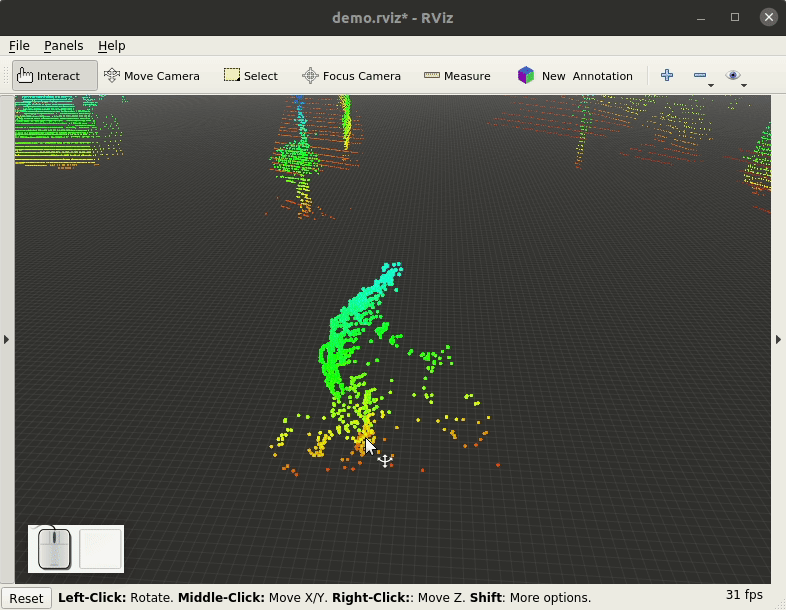
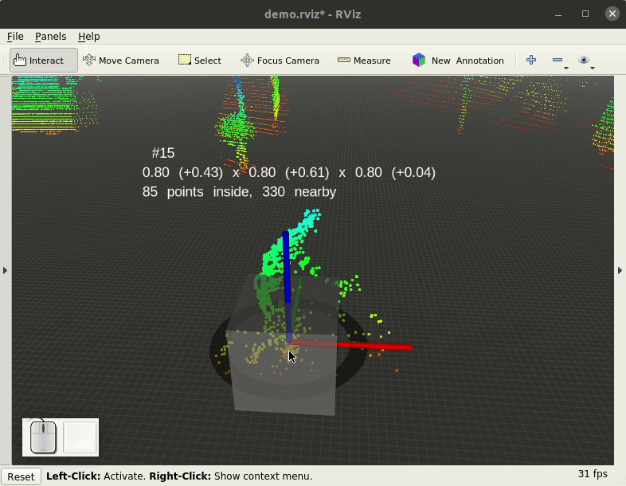
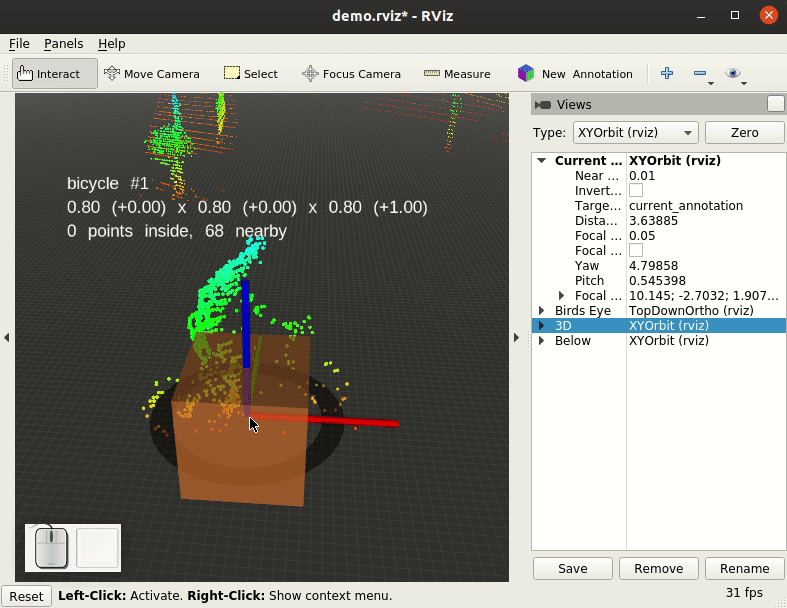

# Labeling with annotate
This guide teaches basic annotation concepts used in annotate. Read on to learn how to
* setup your ROS environment to start annotating
* create the first annotation for a physical object
* create subsequent annotations for the same object
* save time with keyboard shortcuts and linked actions.

The guide uses a real-world example. Setup your local ROS environment as described in the guide to follow in parallel using a hands-on approach.

## Preparation
The example described in the rest of this document uses a real-world labeling example taken from the [KITTI Vision Benchmark Suite](http://www.cvlibs.net/datasets/kitti/). The example bag file is a 16 seconds long traffic sequence called 2011_09_26_drive_0005.bag created using [kitti_to_rosbag](https://github.com/ethz-asl/kitti_to_rosbag). It provides lidar data from a Velodyne HDL-64 in the velodyne_points topic.

Do you have a different ROS bag file with point cloud data at hand that should be annotated? You can also follow the guide using that bag file. Some sections need slight adjustments; the guide will point out these differences.

The annotation environment in ROS consists of two parts:
* Point cloud data on a ROS topic in `sensor_msgs/PointCloud2` format. Usually it comes from `rosbag play` &mdash; either directly or after some conversion or filtering.
* RViz running with the annotate plugins installed.

Creating annotations takes some time. Hence point cloud data should only change when you are ready for it. For `rosbag play`, its `--pause-topics` parameter works well to achieve this: Instruct `rosbag play` to pause after each new data on the point cloud topic, and resume playback when you are done creating annotations for the current data.

Use the ```demo.launch``` launch file that ships with annotate to start both `rosbag play` and RViz at once:

```bash
roslaunch annotate demo.launch \
  bag:="/workspace/kitti/2011_09_26/2011_09_26_drive_0005_sync_pointcloud.bag --pause-topics velodyne_points"
```

For a custom bag file, please adjust the path to the bag file and the point cloud topic to pause on. In case you are not using `demo.launch`, but start RViz manually, you have to configure RViz for annotations:
* In the `Tools` panel, use the `+` icon to add the `New Annotation` tool.
* In the `Displays` panel, use the `Add` button to add an `Annotated PointCloud2` display for the point cloud topic you want to annotate.

Starting `demo.launch` from annotate will open an RViz window for data annotation. Initially you will not see any point cloud data, because playback has paused directly. Press <kbd>space</kbd> once or twice to resume playback until point cloud data appears.

You are ready to create the first annotation now. The next section explains that in detail. It uses the cyclist in the beginning of the scene as its annotation object. Do you want to follow up in parallel? Then please spot the cyclist in the scene and focus the RViz view on it before reading on.

## Creating a new annotation
After you have spotted a new object for annotation, create a new annotation for it in two steps:
* Click on the **New Annotation** button in the RViz tools panel.
* Click on the object in the pointcloud.

Annotate will create a new annotation at the point you clicked in the scene. It has a default size and no label attached yet like in the following video:



### Assigning a label

Assign a label for the new annotation using the context menu.
* Right-click on the annotation cube (bounding box).
* Select a label in the **Label** menu of the context menu.
* Note how the annotation description above the annotation cube now includes the chosen label.

In the following video the bicyclist is labeled ```bicycle```:



A label is carried over to subsequent annotations of the same object. You can, however, change an annotation's label at any time. This is useful, for example, to mark special situations like partial occlusions of objects. Consult your teams annotation guidelines for instructions on special situations.

### Bounding box alignment

The position and size of an annotation's bounding box is crucial information. A carefully aligned bounding box:

* Contains all points of the object.
* Tightly fits all object points such that the distance between the outmost points and the annotation box walls is small in all dimensions.
* Has the red axis point towards the primary direction of the object.

The primary direction of an object can mean different things. For example, for a car it could mean its front. But it could also mean its driving direction &mdash; its front for forward driving and standstill and its rear for reverse driving. Consult your teams annotation guidelines to learn about the meaning of the primary direction of each object type.

Follow these steps to get a carefully aligned bounding box:

1. Change the annotation's **box mode** to **Move**. A black circle around the annotation box appears.
2. Change the RViz view to see the object from top (birds-eye view).
3. Drag the black ring to move the annotation box. Align its center with the object's center
4. Click on the object's annotation box to switch from move to rotation mode. The formerly black ring becomes blue.
5. Drag the blue ring to align the red axis with the object's front
6. Click on the object's annotation box once again to switch from rotation mode to resize mode. The blue ring is replaced with six colored resize handles (arrows).
7. Use the resize handles to roughly align the objects' annotation box size with the size of the object.
8. Right-click on the annotation box and choose **Auto-fit Box** from the **Edit** menu.

While the list of steps may seem daunting at first sight, the process is actually a quick one as the following video shows:



Please note the annotation's description text above the box in the end of the video. It reads

> ```bicycle #1```<br />
> ```1.80 (+0.05) x 0.60 (+0.05) x 1.66 (+0.05)```<br/>
> ```841 points inside, 0 nearby```

The second line tells us that our box now has a length of 1.80 m, a width of 0.60 m and a height of 1.66 m. It also tells us that for each of those dimensions, the box could be shrinked by just 0.05 m. This is because the *auto-fit* feature (just like the *shrink to points* feature) leaves a margin of 0.025 m (2.5 cm) to every side. This means the box is a tight fit around all points inside.

The third line tells us that there are 841 points inside the annotation box, and zero points in a distance of up to 0.25 m to it. Visual inspection also shows that we did not forget any point in the vicinity of the object.

You can conclude that an annotation box is a well-aligned box if the following holds:

* The second line of the annotation description reads ```(+0.05)``` for all three dimensions &mdash; we have a tight fit.
* Visual inspection shows that there are no object points outside of the annotation box.

### Committing

### Summary
In order to create a new annotation for an object that has not been annotated yet in the scene, follow these steps:

1. Spot the object in RViz and focus the view on it.
2. Click on the '''New Annotation''' button.
3. Click on the object in the RViz view.
4. Right-click on the object's annotation box and assign a label.
5. Change the RViz view to see the object from top (birds-eye view).
6. Drag the black ring to move the annotation box. Align its center with the object's center
7. Click on the object's annotation box to switch from move to rotation mode. The formerly black ring becomes blue.
8. Drag the blue ring to align the red axis with the object's front
9. Click on the object's annotation box once again to switch from rotation mode to resize mode. The blue ring is replaced with six colored resize handles (arrows).
10. Use the resize handles to roughly align the objects' annotation box size with the size of the object.
11. Right-click on the annotation box and choose **Auto-fit Box** from the **Edit** menu.
12. Perform a sanity check of the annotation box: The red axis should be aligned with the object front. All object points have to be within the annotation box. The annotation box should be tight around the object points.
13. If the sanity check fails, repeat the steps above to correct the found problem.
14. If the sanity check succeeds, right-click on the annotation box and choose **Commit**. The annotation box turns green.

Most objects change their position and shape in the scene only gradually. Accordingly subsequent annotations are similar in shape and position. Annotate uses this fact to facilitate creating so-called annotation tracks, the change of an object's position and shape over time. Continue reading the next section to learn about annotation tracks in detail.

## Creating annotation tracks
In the previous section you created a new annotation for the cyclist. The new annotation automatically created an *annotation track* with a unique identifier (`#15`). The first commit created the first *annotation instance* for that annotation track. An annotation instance holds all annotation properties for a given point in time: The bounding box (position and shape), the assigned label and the assigned tags. Only the identifier is not stored with an annotation instance, but with its track.

You are now ready to create the second *annotation instance* for the cyclist. To do that, first move forward a bit in time to the next point cloud data. Press <kbd>space</kbd> to accomplish this. The point cloud changes slightly and the cyclist moves forward a bit. Note how the previously created annotation for the cyclist stays around at its earlier position, but changes color from green (committed) to gray.

Create the second annotation instance for the cyclist by following steps 5. (change to birds-eye view) to 14. in the previous section. The commit in step 14 turns the bounding box green again, but another change occurs: A line is shown connecting the earlier bounding box center to the new center. This is a visual aid to see the object's movement over time.

Move on to create the third annotation instance: Press <kbd>space</kbd> again. Note that this time the old annotation instance does not stay at its previous position, but moves with the object. Annotate calculates the new position based on the previous two annotation instances. The estimated position is accurate as long as the object keeps its speed and direction. This helps to reduce the effort needed to align the bounding box perfectly. Often a call of the auto-fit action is all that is needed.

Before committing the annotation instance, check that its label and tags are still accurate. Annotate will carry on the label and tags of the previous instance, but occasionally they change. For example, the cyclist could dismount the bike and become a pedestrian.

Continue the track annotation process for as long as the cyclist is visible in the scene. You will end up with an entire annotation track for the cyclist, which is all that is needed to annotate him.

To summarize, the following process creates an entire annotation track for a new object that becomes visible in the scene:

1. Create a new annotation as described in the previous section.
2. Press <kbd>space</kbd> to move forward in time.
3. If the object is not visible anymore, you are done.
3. Otherwise, align the bounding box perfectly.
4. Adjust the label, if needed.
5. Adjust tags, if needed.
6. Commit the annotation instance.
7. Go to step 2.

The cyclist is not the only object in the scene that should be annotated. The annotation process for the other objects follows the same principle, however. When annotating multiple objects, there are two basic strategies:

* Annotating one object after the other, restarting playback several times.
* Annotating all visible objects per time step, and only move forward in time afterwards.

Which strategy you want to follow is up to you. If you are unsure, go for the first one (annotating one object after the other). Focussing on one object at a time is usually faster and leads to more accurate annotations.

## Using Keyboard Shortcuts
tbd.

## Linking Actions
tbd.
